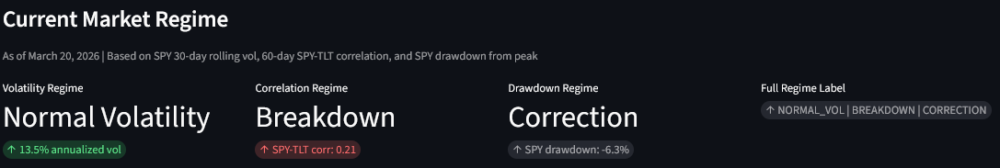
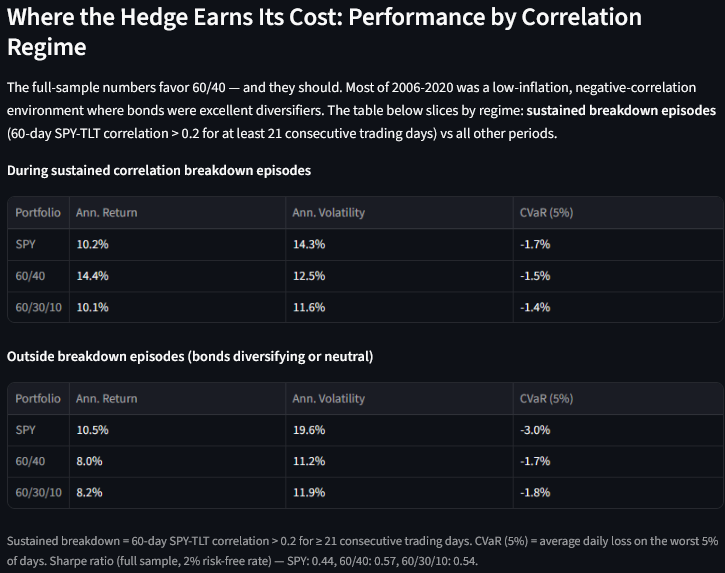
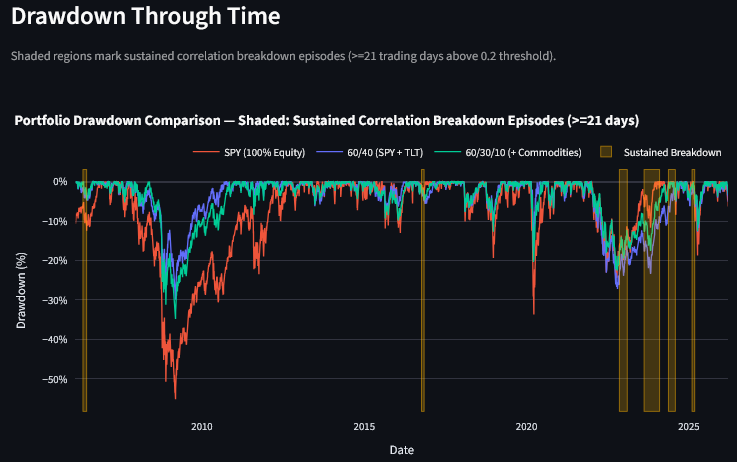
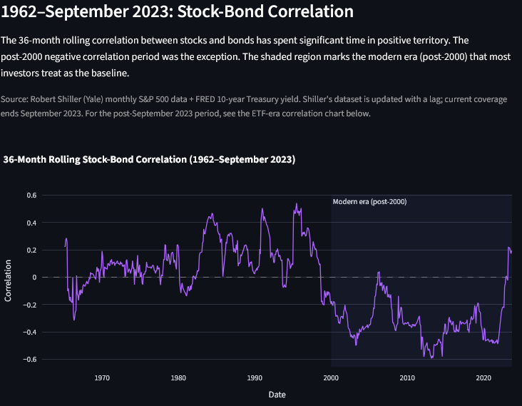

# Market Risk Project
## Regime Dependence of Stock-Bond Diversification

**[Live Dashboard](https://marketriskproject-7tn7cdfwyuyhbuquj2y6kh.streamlit.app/)**

---

## The Finding

The negative stock-bond correlation that made the classic 60/40 portfolio so effective from
2000-2020 was historically unusual — not the long-run norm. Prior to 2000, stocks and bonds
were predominantly positively correlated. The 2022 inflation shock was a partial reversion to
that historical baseline, and it exposed a structural vulnerability in 60/40.

During the 6 **sustained correlation breakdown episodes** identified since 2006 (periods where
the 60-day SPY-TLT correlation exceeded 0.2 for at least 21 consecutive trading days):

| Portfolio | Ann. Return | Ann. Volatility | CVaR (5%) |
|---|---|---|---|
| SPY (100% Equity) | 10.2% | 14.3% | -1.74% |
| 60/40 (SPY + TLT) | 14.4% | 12.5% | -1.46% |
| **60/30/10 (+ Commodities)** | **10.1%** | **11.6%** | **-1.35%** |

60/30/10 shows lower volatility and better tail protection precisely when the bond hedge fails.
Outside these episodes — when bonds are doing their job — 60/40 leads on both return and vol.
The commodity allocation behaves as regime insurance: low cost in benign environments,
meaningful stabilization when the correlation flips.

In 2022 specifically, 60/40 was actually *worse* than SPY on drawdown (-27.2% vs -24.5%),
because TLT declined alongside equities once the correlation turned positive. 60/30/10
drawdown: -22.5%.

---

## Dashboard

[](https://marketriskproject-7tn7cdfwyuyhbuquj2y6kh.streamlit.app/)

The **Executive Summary** tab shows the current market regime across three axes (volatility,
correlation, drawdown), the regime-sliced performance comparison, and the drawdown chart with
sustained breakdown episodes shaded.

[](https://marketriskproject-7tn7cdfwyuyhbuquj2y6kh.streamlit.app/)

[](https://marketriskproject-7tn7cdfwyuyhbuquj2y6kh.streamlit.app/)

The **Deep Dive** tab covers 60+ years of stock-bond correlation history, decade-level
structure, tail risk before and after the 2022 regime shift, and real yield shock comparisons
between the 1970s and 2020s inflation episodes.

[](https://marketriskproject-7tn7cdfwyuyhbuquj2y6kh.streamlit.app/)

---

## Research Questions

1. How persistent is negative stock-bond correlation across macro history?
2. Was the 2000-2020 regime historically anomalous?
3. How did diversification behave during inflation-driven drawdowns?
4. Can modest commodity exposure improve portfolio robustness without overfitting?

---

## Data & Methodology

### Modern ETF Layer (2006-Present)

**Assets:** SPY (equities), TLT (long-duration Treasuries), DBC (broad commodities)

**Metrics:** Daily returns, rolling 30-day volatility, rolling 60-day SPY-TLT correlation,
drawdowns, tail risk (VaR, CVaR at 5th percentile)

**Portfolios compared:** 60/40 (SPY + TLT) vs 60/30/10 (SPY + TLT + DBC)

**Regime classification:** Each trading day is labeled across three axes:
- Volatility: LOW_VOL / NORMAL_VOL / HIGH_VOL (30-day rolling, percentile thresholds)
- Correlation: DIVERSIFYING / NEUTRAL / BREAKDOWN (60-day rolling, ±0.2 thresholds)
- Drawdown: NORMAL / CORRECTION / STRESS (-5% / -10% thresholds)

**Sustained breakdown episodes:** Correlation breakdown days are grouped into contiguous runs;
only runs of 21+ trading days (one full monthly cycle) are treated as meaningful regime
episodes. This filters single-day or week-long spikes that reflect noise rather than structural
shift.

### Historical Macro Layer (1962-September 2023)

**Data sources:** Robert Shiller S&P 500 monthly data (Yale), FRED 10-year Treasury yield
(DGS10), FRED CPI (CPIAUCSL)

**Constructed:** Monthly equity and approximate bond returns, 36-month rolling stock-bond
correlation, inflation YoY, real yield proxy (nominal yield minus YoY CPI)

Note: Shiller's dataset is updated with a lag. Current coverage ends September 2023.
The ETF-era data (yfinance) is current to the most recent pipeline run.

---

## Key Findings

### 1. Stock-Bond Correlation Is Regime-Dependent

Correlation has historically been mostly positive prior to 2000, deeply negative during
2000-2020, and rising again since the 2022 inflation shock. The post-2000 period that most
modern portfolio construction assumes as a baseline was historically atypical.

- Pre-2000 average 36-month correlation: **+0.12**
- Post-2000 average 36-month correlation: **-0.32**

### 2. 2022 Was a Rapid Partial Reversion to Historical Norms

The speed of the 2022 correlation transition was historically extreme — comparable in magnitude
to the 1970s inflation shock but compressed into a shorter window. 60/40 max drawdown in 2022
was -27.2%, worse than SPY (-24.5%), because TLT declined alongside equities.

### 3. The Commodity Hedge Is Asymmetric

Over the full sample, 60/30/10 modestly underperforms 60/40 (8.3% vs 8.4% annualized return,
Sharpe 0.54 vs 0.57). The cost is real but small. The benefit is concentrated in the regimes
where it matters most: sustained correlation breakdown episodes, where CVaR improves by
11 basis points per day and annualized volatility drops from 12.5% to 11.6%.

---

## Future Directions

The current analysis identifies regime episodes in hindsight. The harder and more actionable
question — at what point does an investor know they are in a regime shift, and when should they
act — is addressed in [FUTURE_DIRECTIONS.md](FUTURE_DIRECTIONS.md).

The timing problem has several layers: the 60-day rolling correlation window is itself lagged,
confirmation delay means damage may already be in progress before a regime is "called," and
regime exit is at least as difficult as entry. Potential approaches include Hidden Markov
Models, Kalman filtering on correlation, and cost-of-being-wrong analysis on the detection
threshold.

---

## Project Structure

```
market_risk_project/
├── app.py                    # Streamlit dashboard entry point
├── main.py                   # Pipeline orchestrator
├── data/
│   ├── ingestion.py          # yfinance price fetching
│   ├── store.py              # SQLite price cache
│   ├── fred_ingestion.py     # FRED API via fredapi
│   └── shiller_ingestion.py  # Shiller S&P monthly data
├── risk/
│   ├── metrics.py            # Returns, vol, drawdown, regime classification
│   ├── tail_risk.py          # VaR and CVaR by period
│   └── performance.py        # Annualized return, vol, drawdown, Sharpe
├── research/
│   └── historical_regime_analysis.py  # 1962-present macro dataset
├── visuals/
│   └── plots.py              # Plotly figure builders
├── analysis_notes.py         # Exploratory: decade breakdown, yield shocks
├── outputs/                  # Pre-computed CSVs (committed for dashboard)
├── docs/                     # Screenshots for README
├── CHANGELOG.md              # Build history and architectural decisions
└── FUTURE_DIRECTIONS.md      # Regime detection research directions
```

---

## Environment Setup

```bash
py -3.11 -m venv .venv
.\.venv\Scripts\activate
pip install -r requirements-pipeline.txt
```

Dependencies are split by purpose: `requirements.txt` is the dashboard only (what Streamlit
Cloud installs), `requirements-pipeline.txt` adds the data-fetching packages, and
`requirements-dev.txt` adds `pytest`. To only view the dashboard, `requirements.txt` is enough.

Copy `.env.example` to `.env` and add your FRED API key
(free at [fredaccount.stlouisfed.org](https://fredaccount.stlouisfed.org)):

```
FRED_API_KEY=your_key_here
```

Run the pipeline to regenerate outputs:

```bash
python main.py
```

Launch the dashboard locally:

```bash
streamlit run app.py
```

Run the smoke test (renders every view headlessly; also checks no date label is open-ended):

```bash
pip install -r requirements-dev.txt
python -m pytest tests/ -v
```

Developed and tested using Python 3.11.

---

## Tooling

Developed with [Claude Code](https://claude.ai/claude-code) (Anthropic) as an AI
pair-programming assistant — used for architecture decisions, code review, and iterative
build across both the analysis pipeline and the dashboard.
